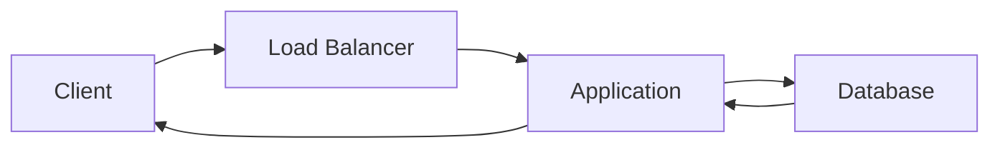

# Chapter 1 — The Inference Revolution

## Why This Matters

Every major shift in computing has created a new engineering discipline.

The rise of relational databases created database administrators and database engineers. The growth of the Internet produced web engineers. Cloud computing gave rise to cloud architects, site reliability engineering (SRE), and platform engineering. Kubernetes introduced an entirely new ecosystem of cloud-native infrastructure specialists.

Large Language Models (LLMs) represent another such shift.

While much public attention has focused on training increasingly capable models, the overwhelming majority of organizations will never train a frontier model. Instead, they will deploy, serve, secure, monitor, and optimize models that already exist. The challenge is no longer how to create a model—it is how to run one efficiently, economically, and reliably at scale.

This challenge is known as **LLM inference**.

Inference engineering sits at the intersection of distributed systems, GPU computing, networking, scheduling, storage, cloud-native platforms, and machine learning infrastructure. It is becoming its own engineering discipline because traditional software architectures were never designed to execute probabilistic models that generate text one token at a time.

This book is about that discipline.

---

# 1.1 Computing Is Entering the Inference Era

For more than three decades, enterprise software has been dominated by transactional systems.

A typical application processed requests using a familiar pipeline:

Although the technologies evolved—from monoliths to microservices, from virtual machines to containers, from data centers to cloud-native platforms—the underlying execution model remained largely unchanged.

A request arrived.

Business logic executed.

Data was retrieved.

A response was returned.

Most architectural improvements focused on scaling this workflow. Faster databases, better caches, improved load balancers, more resilient clusters, and horizontal scaling all targeted the same basic request/response model.

Large Language Models fundamentally change that model.

Instead of retrieving information from a database, an LLM synthesizes new information by executing billions or even trillions of mathematical operations across neural network layers.

Instead of returning a complete response immediately, it generates one token at a time.

Instead of consuming mostly CPU resources, inference depends primarily on accelerators such as GPUs.

Instead of milliseconds of computation, requests may execute for several seconds while continuously consuming expensive hardware.

The architectural implications are profound.

The question is no longer:

> "How do I scale my web service?"

Instead, organizations must answer questions such as:

- How do I keep GPUs fully utilized?
- How many concurrent requests can a model serve?
- Where should prompts be routed?
- How is conversational context preserved?
- How do I minimize latency while maximizing throughput?
- How do I reduce inference cost without sacrificing quality?

These questions define a new category of systems engineering.

---

# 1.2 Training Is Not the Business Problem

Popular media often portrays artificial intelligence as a race to build larger and larger models.

Companies announce trillion-parameter models.

Research papers focus on training techniques.

Benchmark leaderboards celebrate increasingly capable systems.

This creates the impression that training is the central engineering challenge.

For most enterprises, it is not.

Training a frontier model requires enormous investments in hardware, specialized expertise, and months of continuous computation. Only a small number of organizations possess the resources necessary to train state-of-the-art foundation models.

Most enterprises operate very differently.

They consume pre-trained models from providers such as OpenAI, Anthropic, Google, Meta, Mistral AI, or open-source communities. Their competitive advantage lies not in creating models, but in integrating them into products and business processes.

Consider several common enterprise applications:

| Application | Primary Workload |
|-------------|------------------|
| Customer support | Millions of inference requests |
| Coding assistants | Continuous inference |
| Enterprise search | Retrieval plus inference |
| Document summarization | Batch inference |
| Fraud analysis | Real-time inference |
| AI agents | Multi-step inference |

None of these applications train models during normal operation.

They perform inference.

Every user interaction becomes another inference request.

An organization serving one million users may execute billions of inference requests every month while never training a single neural network.

This distinction changes everything.

Training is typically performed once.

Inference executes continuously.

Training is a capital investment.

Inference becomes an operational expense.

Training determines what a model can know.

Inference determines whether a product is economically viable.

As models become commoditized, inference increasingly becomes the competitive advantage.

Organizations that can deliver lower latency, higher throughput, better reliability, and lower operating costs gain a measurable business advantage, even when using the same underlying model as their competitors.

---

# 1.3 Every Token Has a Cost

Traditional software scales primarily with CPU, memory, storage, and network bandwidth.

Inference systems introduce a different economic model.

Every generated token consumes computational resources.

Those resources have direct financial cost.

A simple prompt such as:

> "Summarize this five-page document."

initiates a surprisingly complex execution pipeline.

The request must be tokenized.

The model performs an initial computation over the entire prompt.

GPU memory is allocated.

Intermediate state is stored.

The decoder generates one token.

Then another.

And another.

Each token requires additional computation until the response completes.

Unlike a REST API that often completes after a single database query, inference workloads remain active throughout the entire generation process.

Longer conversations consume more GPU time.

Longer outputs require more decoding.

More concurrent users require more accelerator capacity.

The result is an entirely different optimization problem.

Instead of asking,

> "Can this server handle more requests?"

platform engineers begin asking,

> "Can this GPU generate more tokens per second?"

This seemingly small shift in perspective drives nearly every architectural decision discussed throughout the remainder of this book.
